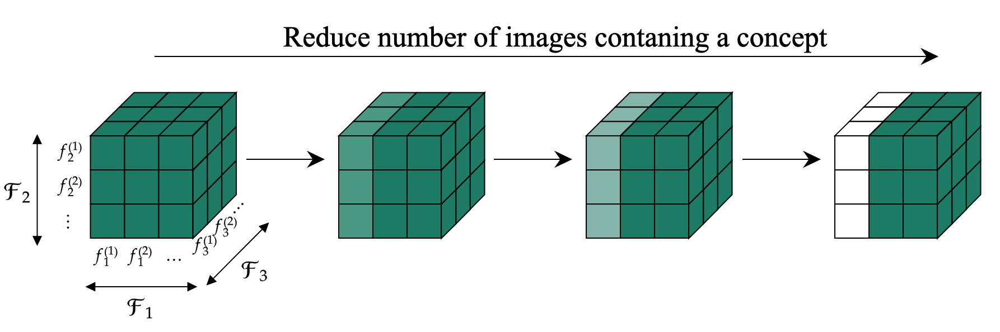

# Concept Reachability

This is the code repository for Concept Reachability in Diffusion Models. To run the code it is required to first generate the train data for the diffusion model (see [generate_dataset.py](./generate_dataset.py)) and store it within a directory labelled `data`. The original balanced dataset is available [here](https://drive.google.com/drive/folders/1je8rXTlkerypXLcj5NPMAV_Y3JgDCahE?usp=share_link).

Images consist of coloured (reg, green, blue) shapes (circle, triangle, square) on a black background, where one shape is partially covered by the other. Captions are of the form 'a {colour} {shape} behind a {colour} {shape}'.

## Experiment 1: Balanced dataset

Analysis of sampling and steering under balanced conditions. The configuration dictionary used for steering is available in [experiment_1.json](./config_dicts/experiment_1.json).

Train a diffusion model:
`python main.py --optim adam --lr 1e-3 --experiment_num 1 --train_dir complete_dataset --task train`

Sample target concepts in dictionary:
`python main.py --optim adam --lr 1e-3 --experiment_num 1 --train_dir complete_dataset --task sample --path_to_config_dict config_dicts/experiment_1.json`

Steer using target and starting prompts in dictionary:
`python main.py --optim adam --lr 1e-3 --experiment_num 1 --train_dir complete_dataset --task steer --path_to_config_dict config_dicts/experiment_1.json`

## Experiment 2: Scarcity of Concepts

The configuration dictionary used for steering is available in [experiment_2.json](./config_dicts/experiment_2.json), targetting reachability to images containing a red triangles behind green squares under the reduction of images containing red shapes in the back.

## Experiment 3: Underspecification of Captions

An additional argument 'test' referring to the reduction of semantic information of the prompt (as in [experiment_3.py](./experiment_3.py)) must be provided. The configuration dictionaries used for steering in the different tests are available in [experiment_3.json](./config_dicts/experiment_3.json). 

## Experiment 4: Biases

The configuration dictionary used for steering is available in [experiment_4.json](./config_dicts/experiment_4.json), targetting reachability to images containing either blue in the back or a circle in the back.
